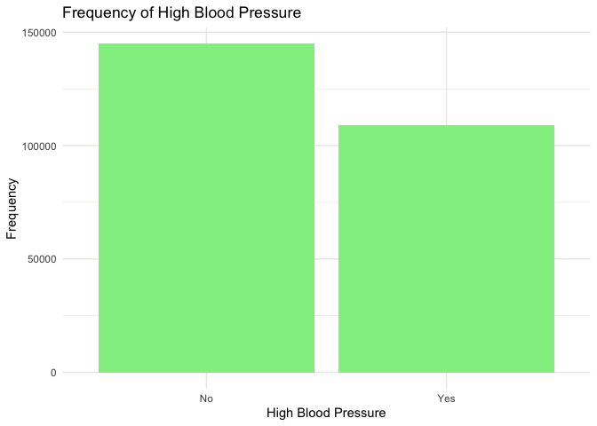
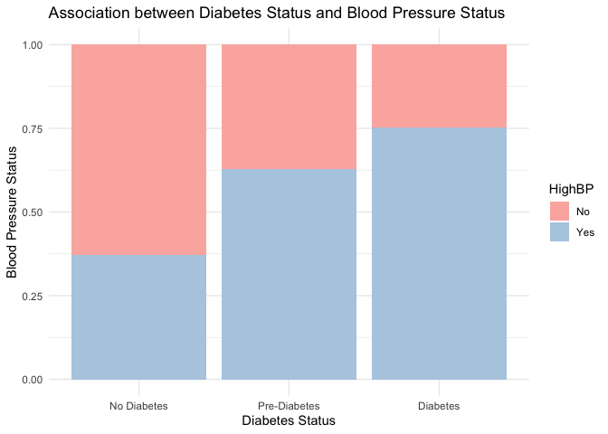

Data cleaning and EDA
================
Qianying Wu
2023-11-21

## Read in Data

``` r
diabetes_raw <- read_csv("data/Diabetes_012_data.csv") |>
  # factor Diabetes to 0, 1, 2
  mutate(Diabetes_012 = factor(Diabetes_012, levels = c(0, 1, 2)),
         HighBP = factor(HighBP, levels = c(0, 1), labels = c("No", "Yes"))) 
```

    ## Rows: 253680 Columns: 22
    ## ── Column specification ────────────────────────────────────────────────────────
    ## Delimiter: ","
    ## dbl (22): Diabetes_012, HighBP, HighChol, CholCheck, BMI, Smoker, Stroke, He...
    ## 
    ## ℹ Use `spec()` to retrieve the full column specification for this data.
    ## ℹ Specify the column types or set `show_col_types = FALSE` to quiet this message.

``` r
head(diabetes_raw)
```

    ## # A tibble: 6 × 22
    ##   Diabetes_012 HighBP HighChol CholCheck   BMI Smoker Stroke
    ##   <fct>        <fct>     <dbl>     <dbl> <dbl>  <dbl>  <dbl>
    ## 1 0            Yes           1         1    40      1      0
    ## 2 0            No            0         0    25      1      0
    ## 3 0            Yes           1         1    28      0      0
    ## 4 0            Yes           0         1    27      0      0
    ## 5 0            Yes           1         1    24      0      0
    ## 6 0            Yes           1         1    25      1      0
    ## # ℹ 15 more variables: HeartDiseaseorAttack <dbl>, PhysActivity <dbl>,
    ## #   Fruits <dbl>, Veggies <dbl>, HvyAlcoholConsump <dbl>, AnyHealthcare <dbl>,
    ## #   NoDocbcCost <dbl>, GenHlth <dbl>, MentHlth <dbl>, PhysHlth <dbl>,
    ## #   DiffWalk <dbl>, Sex <dbl>, Age <dbl>, Education <dbl>, Income <dbl>

## Exploratory Data Analysis

### Univariate Analysis

#### Diabetes Type

``` r
diabetes_raw$Diabetes_012 <- factor(diabetes_raw$Diabetes_012, levels = c(0, 1, 2),
                                     labels = c("No Diabetes", "Pre-Diabetes", "Diabetes"))

# Use ggplot2 to plot the frequency chart
ggplot(data = diabetes_raw) +
  geom_bar(mapping = aes(x = Diabetes_012), fill = "skyblue") +
  labs(x = "Diabetes Status", y = "Frequency", title = "Frequency of Diabetes Categories") +
  theme_minimal()
```

<!-- -->

#### High Blood Pressure

``` r
ggplot(data = diabetes_raw) +
  geom_bar(mapping = aes(x = HighBP), fill = "lightgreen") +
  labs(x = "High Blood Pressure", y = "Frequency", title = "Frequency of High Blood Pressure") +
  theme_minimal()
```

<!-- -->

#### bmi categorization

``` r
# write a function to categorize bmi values to diverse weight status
categorize_bmi <- function(bmi) {
  if (bmi < 18.5) {
    return("Underweight")
  } else if (bmi >= 18.5 & bmi < 25) {
    return("Normal weight")
  } else if (bmi >= 25 & bmi < 30) {
    return("Overweight")
  } else {
    return("Obesity")
  }
}
# add a column named weight_status to the data set
diabetes_raw$weight_status <- sapply(diabetes_raw$BMI, categorize_bmi)
```

#### Plot: Association between Diabetes Status and Weight Status

``` r
ggplot(diabetes_raw, aes(x = Diabetes_012, fill = weight_status)) +
  geom_bar(position = "fill") +
  ylab("Proportion") +
  xlab("Diabetes Status") +
  ggtitle("Association between Diabetes Status and Weight Status") +
  scale_fill_brewer(palette = "Pastel1") +
  theme_minimal()
```

<!-- -->

#### 

### Bivariate Analysis

#### High Blood Pressure in Different Diabetes Status
